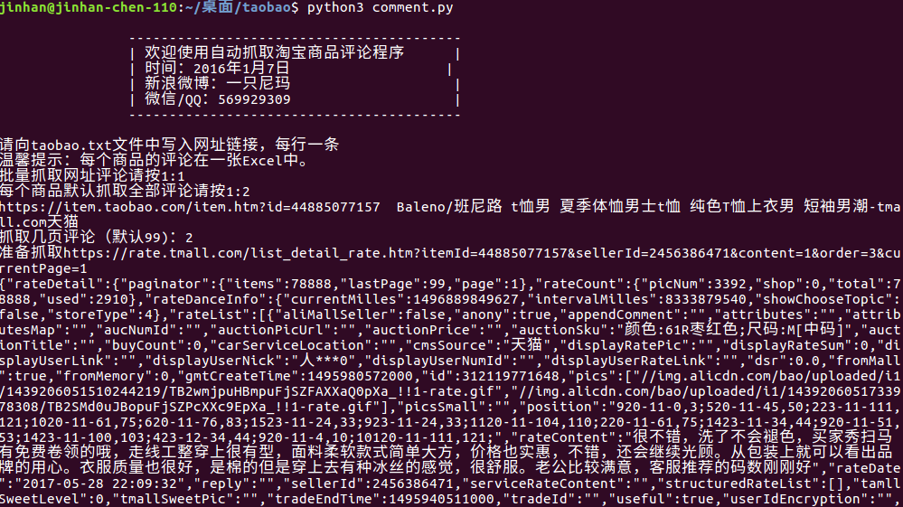
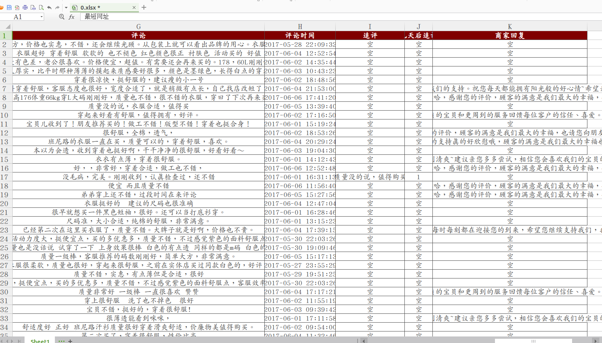

# 天猫淘宝商品评论爬虫说明


本人开了新库，使用Golang语言，更多精彩请移动到[https://github.com/hunterhug/GoTaoBao](https://github.com/hunterhug/GoTaoBao)

# 一.项目结构

```
-----taobaocomment
	-------source	源代码
	-------excel	你要的结果
	-------run.bat	你要跑的脚本
	-------exe.rar	请解压变成exe
	-------taobao.txt	抓的商品网址
```

# 二.环境准备

安装[python3](https://www.python.org/downloads/)。然后设置环境变量设置。

## 1.安装依赖模块

```
pip3 install -r requirement.txt

```

## 2.打包exe

转到源代码文件夹`source`, 执行打包命令！

```
python setup.py build
```

把`exe.win32-3.4`文件夹移到根目录，改名为exe

# 三.开始使用

先往`taobao.txt`中按行写入商品链接

```
网址格式有如下几种(#开头的网址直接被忽视):
https://item.taobao.com/item.htm?spm=a1z10.1-c.w4004-7841214359.4.6lp4CP&id=525842199471
https://detail.tmall.com/item.htm?spm=a230r.1.14.6.o11GZI&id=41389303364&cm_id=140105335569ed55e27b&abbucket=3
https://item.taobao.com/item.htm?id=40066362090
https://rate.tmall.com/list_detail_rate.htm?itemId=45789209181&sellerId=2274061169&order=3&currentPage=2
https://item.taobao.com/item.htm?spm=a230r.1.14.37.B4SrL2&id=45804256292&ns=1&abbucket=3#detail
http://a.m.taobao.com/i44628690678.htm?&abtest=16&sid=ceff9ca9adb294b3459844e3640a76d1
```

执行

```
run.bat

或者
cd source
python taobaocomment.py

或者

pythonrun.bat
```


# 四.演示





Do not understand?contact me.<br/>
author:hunterhug<br/>
2015/11

如果你觉得项目帮助到你,欢迎请我喝杯咖啡

微信


支付宝


